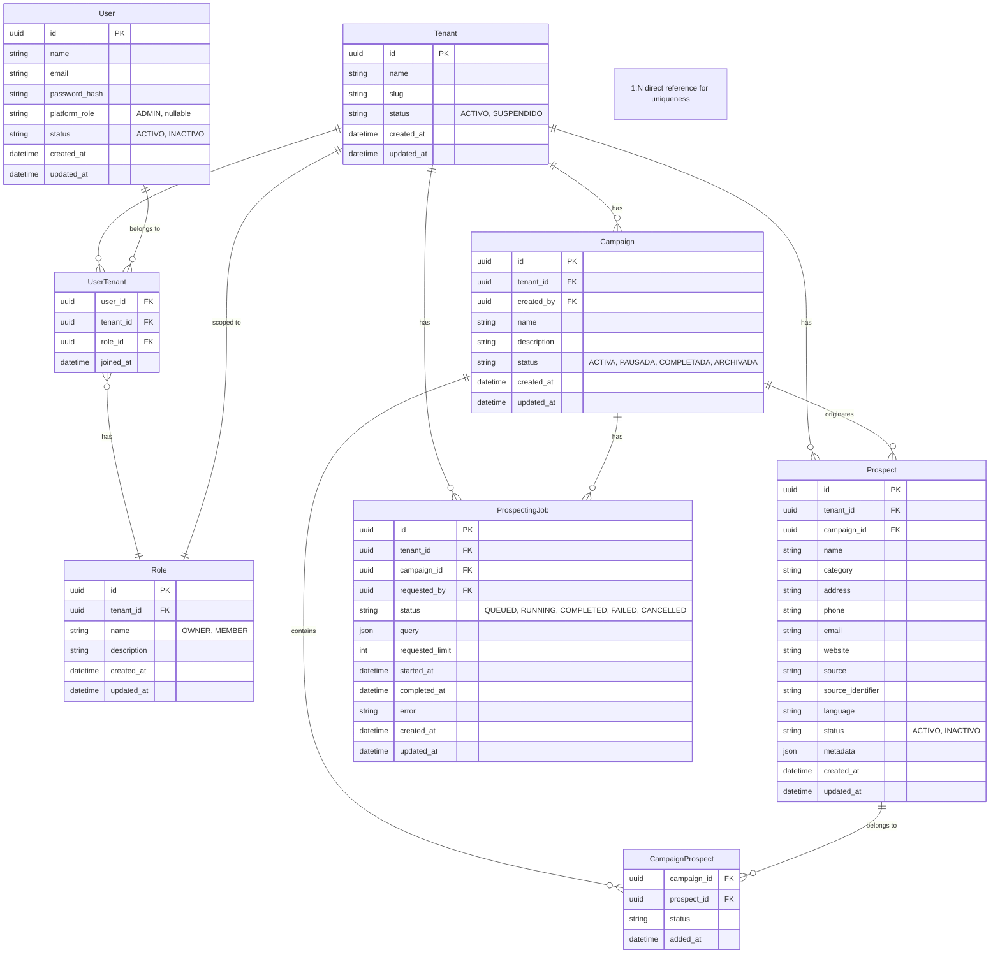

# ADR-001 — Decisiones de Dominio para el MVP del SaaS Backend

**Estado:** Aceptado  
**Fecha:** Septiembre 2026  
**Decisores:** Equipo de proyecto  
**Área:** Dominio del SaaS Backend (NestJS + Prisma + PostgreSQL)

---

## 1. Contexto

El proyecto se encuentra en la Fase 1 de diseño de dominio. La documentación base (ActaConceptual, ModeloArquitectonico, Contexto del Proyecto) define entidades y relaciones generales, pero deja múltiples decisiones abiertas. El equipo ha respondido formalmente a las preguntas planteadas en el checklist de arquitectura, estableciendo el modelo de dominio definitivo para el MVP.

El presente ADR documenta esas decisiones, transformando el dominio conceptual en una especificación vinculante para la construcción del esquema Prisma, los módulos NestJS y los contratos de API.

---

## 2. Decisiones Formalizadas

### 2.1. Modelo de Usuarios y Tenants (Multi-tenancy)

| Decisión | Valor | Clasificación |
|----------|-------|---------------|
| **Un usuario puede pertenecer a múltiples tenants** | Sí | DEFINIDA (respuesta A-001) |
| **Existe una entidad Membership entre User y Tenant** | Sí, tabla `UserTenant` | DEFINIDA (respuesta A-002) |
| **Selección de tenant** | El usuario selecciona el tenant al iniciar sesión; el tenant se determina automáticamente mediante Guards e IsolationStrategy durante la sesión | DEFINIDA (respuesta a pregunta de cambio de tenant) |
| **Tenant Resolution** | Se integra con AuthStrategy; el tenant se deriva del contexto autenticado, nunca de un parámetro del cliente | DEFINIDA (Acta §20) |

**Impacto en el modelo:**

- `User` **NO** tiene `tenant_id`. 
- Se crea la entidad `UserTenant` (membership) con `user_id` + `tenant_id`.
- La resolución del tenant ocurre en la capa de aplicación (Guards/Interceptors), no en el modelo.

---

### 2.2. Modelo de Roles y Permisos

| Decisión | Valor | Clasificación |
|----------|-------|---------------|
| **Sistema de autorización** | Solo roles (sin permisos granulares) para el MVP | DEFINIDA (respuesta A-003) |
| **Alcance de roles** | Tenant-scoped. `Role` tiene `tenant_id` | DEFINIDA (respuesta A-004) |
| **Relación User ↔ Role** | N:M indirecta: cada membresía `UserTenant` tiene un `roleId` hacia un `Role` tenant-scoped | DEFINIDA (F4-C02) |
| **Roles tenant-scoped** | `OWNER`, `MEMBER` | DEFINIDA (F4-C02) |
| **Rol global de plataforma** | `User.platformRole = ADMIN`; no pertenece a `Role` ni requiere `UserTenant` | DEFINIDA (F4-C01) |
| **Permisos implícitos por rol** | • `ADMIN`: permisos administrativos sobre el sistema completo.<br>• `OWNER`: permisos administrativos sobre su tenant asociado, respetando el aislamiento de datos.<br>• `MEMBER`: permisos de lectura y escritura sobre `Campaign`, `Prospect` y `ProspectingJob`. Puede exportar o persistir resultados de búsqueda. | DEFINIDA (F4-C01, F4-C02) |

**Impacto en el modelo:**

- `Role` tiene `tenant_id`.
- `UserTenant` tiene `roleId` (FK a Role).
- `User` puede tener `platformRole` nullable para representar a un `ADMIN` global.
- No se implementa `Permission` ni `RolePermission` en el MVP. Las validaciones se implementan mediante lógica condicional en los Guards/Services basada en `role.name`.

---

### 2.3. Modelo de Campañas (Campaign)

| Decisión | Valor | Clasificación |
|----------|-------|---------------|
| **Estados de Campaign** | `ACTIVA`, `PAUSADA`, `COMPLETADA`, `ARCHIVADA` | DEFINIDA (respuesta A-010) |
| **Propietario de Campaign** | Sí. Tiene `created_by` (FK a User) | DEFINIDA (respuesta A-011) |
| **Eliminación lógica** | `MEMBER` y `OWNER` pueden archivar (cambiar estado a `ARCHIVADA`) | DEFINIDA (respuesta a eliminación) |
| **Eliminación física** | Solo `ADMIN` puede eliminar físicamente (DELETE) | DEFINIDA (respuesta a eliminación) |

**Impacto en el modelo:**

- `Campaign` incluye `created_by` (FK a User).
- La eliminación lógica es un cambio de estado (`status = ARCHIVADA`), sin borrado físico.
- La eliminación física solo está disponible para el rol ADMIN.

---

### 2.4. Modelo de Prospectos e Identidad

| Decisión | Valor | Clasificación |
|----------|-------|---------------|
| **Estrategia de identidad** | `(tenant_id, campaign_id, source, source_identifier)` → UNIQUE | DEFINIDA (respuesta A-006, A-008) |
| **Tenants distintos con el mismo Prospect** | Sí, la unicidad solo es dentro del tenant (y campaña) | DEFINIDA (respuesta A-009) |
| **Prospect es único dentro del tenant** | Sí, dentro de la combinación especificada | DEFINIDA (respuesta A-008) |
| **Manejo de `source_identifier` nulo** | Generar un hash con `name + address + phone` | DEFINIDA (respuesta a qué hacer sin source_identifier) |
| **Actualización de datos desde el Engine** | Los resultados de una búsqueda se mantienen en caché del backend SaaS hasta que el usuario decida exportar, comparar con existentes (para eliminar duplicados desde el SaaS), guardar en DB, o descartar. La lista de resultados se identifica por `searchQuery` para trazabilidad de los inputs que las generaron. | DEFINIDA (respuesta a actualización de Prospect) |

**Nota crítica sobre la identidad:**  
La decisión de incluir `campaign_id` en la clave única implica que un mismo negocio real (misma empresa) **puede tener registros de Prospect distintos para campañas diferentes**, porque la unicidad se evalúa por campaña. Esto es una decisión deliberada de simplificación para el MVP, que prioriza la trazabilidad de resultados por campaña sobre la deduplicación global de entidades.

**Impacto en el modelo:**

- `Prospect` incluye `campaign_id` (FK a Campaign).
- `UNIQUE` constraint en `(tenant_id, campaign_id, source, source_identifier)`.
- `Prospect` **no** tiene `tenant_id` de forma directa (se deriva de `campaign_id` → `Campaign.tenant_id`), aunque por denormalización puede mantenerse para facilitar consultas. En el ER se mantiene `tenant_id` explícito para evitar joins costosos en consultas de lista.
- `CampaignProspect` sigue existiendo como relación N:M, permitiendo que un Prospect se asocie a múltiples campañas (aunque la identidad esté anclada a una campaña origen).

---

### 2.5. Modelo de ProspectingJob

| Decisión | Valor | Clasificación |
|----------|-------|---------------|
| **Múltiples búsquedas por Job** | No. 1 Job = 1 query (para el MVP) | DEFINIDA (respuesta A-013) |
| **Estructura de `query`** | JSON simple: `{ keyword, location, source, limit }` | DEFINIDA (respuesta A-014) |
| **Estados de Job** | `QUEUED`, `RUNNING`, `COMPLETED`, `FAILED`, `CANCELLED` | DEFINIDA (respuesta A-015 y ModeloArq §33) |
| **Cancelación** | Sí. Estado `CANCELLED` | DEFINIDA (respuesta A-015) |
| **Detención de ejecución** | Pendiente de definición técnica (comunicación con Prospector Engine) | ABIERTA (parcial) |

**Impacto en el modelo:**

- `ProspectingJob` tiene `query` (tipo JSON).
- Se agrega el estado `CANCELLED`.
- La relación con `Campaign` es N:1 (una campaña puede tener múltiples jobs).

---

### 2.6. Persistencia de Resultados de ProspectingJob

| Decisión | Valor | Clasificación |
|----------|-------|---------------|
| **Almacenamiento de resultados** | Los resultados son temporales (caché). El usuario decide: exportar (CSV/XLSX), persistir en DB, o descartar. | DEFINIDA (respuesta A-017) |
| **Asociación a Campaign** | El Job está asociado a una Campaign. Al persistir, se crean `Prospect` y `CampaignProspect` automáticamente. | DEFINIDA (respuesta a preguntas de ProspectingJob) |
| **Deduplicación al persistir** | El SaaS compara con prospectos existentes para eliminar duplicados antes de persistir. | DEFINIDA (respuesta a actualización de Prospect) |

**Impacto en el modelo:**

- No existe tabla de "resultados temporales" en el dominio persistente.
- La persistencia crea registros en `Prospect` y `CampaignProspect`.
- El flujo de deduplicación es responsabilidad del módulo `Prospects` del SaaS Backend.

---

### 2.7. Seguridad y Auditoría

| Decisión | Valor | Clasificación |
|----------|-------|---------------|
| **Auditoría completa** | No para el MVP | DEFINIDA (respuesta a auditoría) |
| **Logs de Login/Logout** | Sí | DEFINIDA (respuesta a auditoría) |
| **Logs de ciclo de vida de ProspectingJob** | Sí (quién, qué, cuándo, resultado) | DEFINIDA (respuesta a auditoría) |
| **Log de creación/eliminación de campañas** | Opcional. No es requisito del MVP. | DEFINIDA (respuesta a auditoría) |

**Impacto en el modelo:**

- No se incluyen tablas de auditoría en el MVP.
- Los logs se implementarán a nivel de aplicación (NestJS Logger) para eventos de autenticación y Jobs.

---

### 2.8. Estados de Entidades (Resumen)

| Entidad | Estados | Valores |
|---------|---------|---------|
| **Tenant** | DEFINIDA | `ACTIVO`, `SUSPENDIDO` |
| **User** | DEFINIDA | `ACTIVO`, `INACTIVO` |
| **Campaign** | DEFINIDA | `ACTIVA`, `PAUSADA`, `COMPLETADA`, `ARCHIVADA` |
| **Prospect** | DEFINIDA | `ACTIVO`, `INACTIVO` |
| **ProspectingJob** | DEFINIDA | `QUEUED`, `RUNNING`, `COMPLETED`, `FAILED`, `CANCELLED` |

---

## 3. Modelo ER Actualizado (Post-Decisiones)

### Versión Textual

```
Tenant (1) ──── (N) UserTenant (N) ──── (1) User
   │                    │
   │                    └── Role (tenant-scoped)
   │
   ├── (1) ──── (N) Campaign
   │                │
   │                ├── (1) ──── (N) ProspectingJob
   │                │
   │                └── (N) ──── (M) CampaignProspect
   │
   └── (1) ──── (N) Prospect (via Campaign)

User (1) ──── (N) UserTenant (N) ──── (1) Role (tenant-scoped)
```

**Nota:** `Prospect` se relaciona con `Campaign` directamente (tiene `campaign_id`) y también a través de `CampaignProspect` (N:M). La relación directa establece la campaña de origen y la clave única; la relación N:M permite asociaciones adicionales.

---

### Modelo Mermaid ER



---

## 4. Reglas de Negocio Actualizadas (Nuevas y Modificadas)

| ID | Regla | Entidad | Fuente |
|----|-------|---------|--------|
| BR-USER-005 | Un usuario puede pertenecer a múltiples tenants a través de UserTenant | User | ADR |
| BR-USER-006 | El tenant se determina automáticamente mediante Guards/IsolationStrategy, no por parámetros del cliente | User | Acta §20, ADR |
| BR-USER-007 | Un usuario tiene un único rol (relación 1:1) | User | ADR |
| BR-USER-008 | Los roles son tenant-scoped | Role | ADR |
| BR-ROLE-001 | Roles tenant-scoped: OWNER y MEMBER. ADMIN es platformRole global | Role/User | F4-C01, F4-C02 |
| BR-CAMPAIGN-006 | Una campaña tiene un propietario (created_by) | Campaign | ADR |
| BR-CAMPAIGN-007 | MEMBER y OWNER pueden archivar campañas (status = ARCHIVADA) | Campaign | ADR |
| BR-CAMPAIGN-008 | Solo ADMIN puede eliminar físicamente una campaña | Campaign | ADR |
| BR-PROSPECT-006 | Un Prospect se identifica por (tenant_id, campaign_id, source, source_identifier) | Prospect | ADR |
| BR-PROSPECT-007 | Si source_identifier es null, se genera hash de name + address + phone | Prospect | ADR |
| BR-PROSPECT-008 | Los resultados de prospección se mantienen en caché hasta que el usuario decida persistir/exportar/descartar | Prospect | ADR |
| BR-JOB-005 | Un ProspectingJob contiene una única búsqueda (1 Job = 1 query) | ProspectingJob | ADR |
| BR-JOB-006 | Estructura de query: { keyword, location, source, limit } | ProspectingJob | ADR |
| BR-JOB-007 | Un Job puede ser cancelado (estado CANCELLED) | ProspectingJob | ADR |

---

## 5. Decisiones Postergadas (No bloquean el MVP)

| ID | Decisión | Razón |
|----|----------|-------|
| P-001 | Política de reintentos para Jobs fallidos | Se puede implementar después |
| P-002 | Auditoría completa de operaciones | No es requerimiento funcional del MVP |
| P-003 | Tabla de resultados de ProspectingJob (histórico) | Se puede añadir después |
| P-004 | Métricas agregadas (dashboard avanzado) | Se puede añadir después |
| P-005 | Mecanismo exacto de cancelación en Prospector Engine | Requiere coordinación técnica con el Engine |

---

## 6. Consecuencias Arquitectónicas

### 6.1. Impacto en Prisma Schema

- Se debe modelar `UserTenant` como tabla intermedia.
- `User` pierde `tenant_id` y no tiene rol tenant-scoped directo; puede tener `platformRole` nullable.
- `UserTenant` gana `roleId` como FK a `Role`.
- `Role` gana `tenant_id`.
- `Prospect` gana `campaign_id` y pierde `source`/`source_identifier` como clave única simple (se vuelve compuesta con `campaign_id`).
- `Campaign` gana `created_by`.
- `ProspectingJob` agrega estado `CANCELLED`.

### 6.2. Impacto en API Contracts

- El login debe permitir selección de tenant (o devolver lista de tenants disponibles).
- Los endpoints deben recibir el tenant desde el contexto, no desde la URL (salvo que se decida explícitamente).
- `POST /campaigns` debe incluir `created_by` automáticamente desde el usuario autenticado.
- `POST /prospecting-jobs` recibe `query` con la estructura definida.
- `DELETE /campaigns/:id` debe validar el rol (solo ADMIN).

### 6.3. Impacto en Autorización

- Se necesita un Guard que:
  1. Autentique al usuario.
  2. Resuelva el tenant activo de la sesión.
  3. Lea tenantRole y platformRole del snapshot JWT validado (ADR-004). UserTenant.roleId se resuelve al emitir contexto, no en cada request.
  4. Inyecte el contexto de tenant y rol en la request.
- Las validaciones de permisos (ej. solo ADMIN para eliminar físicamente) se implementan en los Services utilizando el rol resuelto.

### 6.4. Impacto en la Lógica de Deduplicación

- Al persistir resultados, el SaaS debe buscar duplicados considerando `tenant_id`, `source`, `source_identifier` (ignorando `campaign_id` inicialmente para determinar si el negocio ya existe en el tenant).
- Si existe, se crea un registro en `CampaignProspect` para vincularlo a la campaña actual (y posiblemente actualizar datos).
- Si no existe, se crea un nuevo `Prospect` con `campaign_id` = campaña actual, y se vincula mediante `CampaignProspect`.

---

## 7. Riesgos y Mitigaciones

| Riesgo | Mitigación |
|--------|------------|
| La identidad de Prospect anclada a `campaign_id` puede generar duplicados del mismo negocio en diferentes campañas | Decisión deliberada para MVP. Se puede migrar a una identidad global en versión posterior si se requiere |
| Un usuario con múltiples tenants y un único rol puede tener el mismo rol en todos | Simplificación aceptada para MVP. Se puede evolucionar a roles por tenant si surge la necesidad |
| La cancelación de Jobs requiere comunicación con Prospector Engine | Se define como decisión técnica abierta que se resolverá durante la integración con el servicio |
| La caché de resultados puede generar inconsistencias si el sistema se reinicia | Los resultados en caché son temporales y están vinculados a la sesión/usuario. Se puede implementar una capa de persistencia volátil (Redis) si se requiere en futuras iteraciones |

---

## 8. Estado de las Decisiones

| Categoría | Estado |
|-----------|--------|
| **Multi-tenancy** | CERRADO (User ↔ Tenant N:M vía UserTenant) |
| **Roles** | CERRADO (OWNER/MEMBER por UserTenant; ADMIN global en User.platformRole) |
| **Permisos** | CERRADO (implícitos por rol, sin tablas granulares) |
| **Campaign lifecycle** | CERRADO (estados, propietario, eliminación lógica/física) |
| **Prospect identity** | CERRADO (tenant + campaign + source + source_identifier) |
| **Job lifecycle** | CERRADO (estados, query única, cancelación) |
| **Result persistence** | CERRADO (caché → persistencia bajo demanda) |
| **Auditoría** | CERRADO (solo logs de auth y Job para MVP) |

---

## 9. Anexo — Mapeo de Entidades a Tablas (Conceptual)

| Entidad | Tabla | Clave Primaria | Claves Foráneas | Unicidades |
|---------|-------|----------------|-----------------|------------|
| Tenant | `tenants` | `id` | - | `slug` |
| User | `users` | `id` | `platform_role` | `email` (global) |
| UserTenant | `user_tenants` | `(user_id, tenant_id)` | `user_id`, `tenant_id`, `role_id` | Compuesta |
| Role | `roles` | `id` | `tenant_id` | `(tenant_id, name)` con OWNER/MEMBER |
| Campaign | `campaigns` | `id` | `tenant_id`, `created_by` | - |
| Prospect | `prospects` | `id` | `tenant_id`, `campaign_id` | `(tenant_id, campaign_id, source, source_identifier)` |
| CampaignProspect | `campaign_prospects` | `(campaign_id, prospect_id)` | `campaign_id`, `prospect_id` | Compuesta |
| ProspectingJob | `prospecting_jobs` | `id` | `tenant_id`, `campaign_id`, `requested_by` | - |

---
