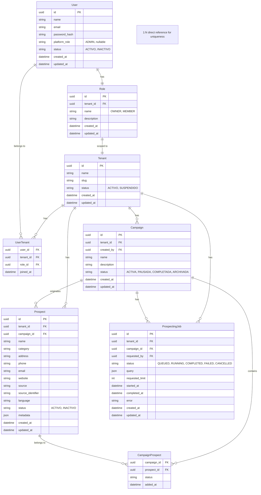

# Fase 1 — Diseño de Dominio del SaaS Backend (Versión Actualizada)

## Análisis basado exclusivamente en la documentación proporcionada y decisiones del ADR-001

---

# 1. Resumen Ejecutivo del Dominio

La plataforma SaaS tiene como propósito central la **gestión de campañas de marketing y prospección automatizada de clientes potenciales**. El dominio se organiza alrededor de los siguientes conceptos fundamentales:

**Multi-tenancy** — La plataforma permite que múltiples organizaciones (tenants) utilicen la misma infraestructura manteniendo sus datos aislados. La estrategia definida es **Shared Database + Shared Schema + Tenant ID**. La relación entre User y Tenant es **N:M** a través de la entidad `UserTenant`.

**Usuarios y autorización** — Cada usuario puede pertenecer a múltiples tenants. El sistema de autorización se basa en **roles** (sin permisos granulares en el MVP). `OWNER` y `MEMBER` son roles **tenant-scoped** asignados mediante `UserTenant.roleId`; `ADMIN` es un `platformRole` global.

**Campañas** — Representan el contexto comercial en el que se utilizan prospectos. Son el principal artefacto de negocio que los usuarios administran. Tienen un propietario (`created_by`) y un conjunto de estados definidos.

**Prospectos** — Representan negocios/empresas potenciales obtenidos mediante el motor de prospección. Su identidad es **tenant-scoped** y se define por la combinación `(tenant_id, campaign_id, source, source_identifier)`. Un Prospect puede pertenecer a múltiples campañas a través de `CampaignProspect`.

**Prospección** — Se modela como un trabajo (`ProspectingJob`) que encapsula una solicitud de extracción de prospectos. Cada Job corresponde a una **única búsqueda** (1 Job = 1 query). Los resultados son **temporales** (caché) hasta que el usuario decide persistirlos, exportarlos o descartarlos.

**Separación de responsabilidades** — El dominio SaaS administra reglas de negocio, tenants, usuarios, campañas y prospectos. La lógica de extracción (Google Maps, scraping, enriquecimiento) pertenece al Prospector Engine, que es consumido a través de Prospector Service.

---

# 2. Entidades Identificadas

Basado en las fuentes y decisiones del ADR-001, las entidades del dominio son:

| # | Entidad | Fuente | Estado |
| --- | --------- | -------- | -------- |
| 1 | Tenant | ActaConceptual, ModeloArquitectonico, ADR-001 | DEFINIDA |
| 2 | User | ActaConceptual, ModeloArquitectonico, ADR-001 | DEFINIDA |
| 3 | UserTenant | ADR-001 (respuesta A-001, A-002) | DEFINIDA |
| 4 | Role | ActaConceptual, ModeloArquitectonico, ADR-001 | DEFINIDA |
| 5 | Campaign | ActaConceptual, ModeloArquitectonico, ADR-001 | DEFINIDA |
| 6 | Prospect | ActaConceptual, ModeloArquitectonico, ADR-001 | DEFINIDA |
| 7 | CampaignProspect | ActaConceptual, ModeloArquitectonico, ADR-001 | DEFINIDA |
| 8 | ProspectingJob | ActaConceptual, ModeloArquitectonico, ADR-001 | DEFINIDA |

> **Nota:** `Permission` y `RolePermission` se definen como conceptos, pero **no se implementan como tablas en el MVP** (respuesta A-003). La autorización se maneja mediante lógica basada en el nombre del rol.

---

# 3. Análisis Detallado de Cada Entidad

## 3.1. Tenant

| Aspecto | Análisis | Estado |
| --------- | ---------- | -------- |
| **Propósito** | Representa una organización que utiliza la plataforma SaaS. Es el contenedor lógico de todos los recursos de un cliente. | DEFINIDA |
| **Responsabilidad** | Aislar la información entre diferentes organizaciones. Proporcionar contexto para todas las operaciones multi-tenant. | DEFINIDA |
| **Atributos mencionados** | `id`, `name`, `slug`, `status`, `created_at`, `updated_at` | DEFINIDA |
| **Identificador** | `id` (PK), `slug` (identificador amigable) | DEFINIDA |
| **Relaciones conocidas** | Tiene Users (vía UserTenant), Campaigns, Prospects, ProspectingJobs, Roles (tenant-scoped) | DEFINIDA |
| **Cardinalidades** | 1 Tenant : N Users (vía UserTenant), 1 Tenant : N Campaigns, 1 Tenant : N Prospects, 1 Tenant : N Roles | DEFINIDA |
| **Estados** | `ACTIVO`, `SUSPENDIDO` | DEFINIDA (ADR-001) |
| **Restricciones conocidas** | Los datos de tenants deben permanecer aislados lógica y funcionalmente. Un usuario no puede consultar/modificar información de otro tenant. | DEFINIDA |
| **Reglas de negocio** | El tenant nunca debe ser confiado únicamente a un parámetro proporcionado por el cliente. Debe derivarse del contexto autenticado. | DEFINIDA |

**Fuentes:** ActaConceptual §18-20, §22; ModeloArquitectonico §20-24; ADR-001 §2.1, §2.8

---

## 3.2. User

| Aspecto | Análisis | Estado |
| --------- | ---------- | -------- |
| **Propósito** | Representa un usuario humano que accede a la plataforma dentro del contexto de uno o más tenants. | DEFINIDA |
| **Responsabilidad** | Autenticación, autorización, realización de operaciones dentro del tenant activo. | DEFINIDA |
| **Atributos mencionados** | `id`, `name`, `email`, `password_hash`, `platform_role`, `status`, `created_at`, `updated_at` | DEFINIDA |
| **Identificador** | `id` (PK), `email` (identidad de autenticación) | DEFINIDA |
| **Relaciones conocidas** | Pertenece a Tenants y obtiene su rol tenant-scoped mediante UserTenant. Puede tener un platformRole global. | DEFINIDA |
| **Cardinalidades** | N Users : M Tenants (vía UserTenant). Cada UserTenant referencia un Role. | DEFINIDA (F4-C01, F4-C02) |
| **Estados** | `ACTIVO`, `INACTIVO` | DEFINIDA (ADR-001) |
| **Restricciones conocidas** | La relación con Tenant es N:M. User no tiene `role_id`; UserTenant tiene `roleId` (FK a Role). | DEFINIDA |
| **Reglas de negocio** | El tenant se determina automáticamente mediante Guards/IsolationStrategy. El usuario puede tener múltiples tenants. | DEFINIDA |
| **Decisiones definidas** | User NO tiene `tenant_id` directo. Relación N:M vía UserTenant. | DEFINIDA (ADR-001) |

**Fuentes:** ActaConceptual §22; ModeloArquitectonico §21; ADR-001 §2.1, §2.2, §2.8

---

## 3.3. Role

| Aspecto | Análisis | Estado |
| --------- | ---------- | -------- |
| **Propósito** | Representa un conjunto de permisos (implícitos) asignados a un usuario dentro de un tenant específico. | DEFINIDA |
| **Responsabilidad** | Controlar qué acciones puede realizar un usuario dentro de la plataforma. | DEFINIDA |
| **Atributos** | `id`, `tenant_id`, `name`, `description`, `created_at`, `updated_at` | DEFINIDA (ADR-001) |
| **Identificador** | `id` (PK); `(tenant_id, name)` único | DEFINIDA |
| **Relaciones conocidas** | Pertenece a Tenant (tenant-scoped) y es referenciado por UserTenant. | DEFINIDA |
| **Cardinalidades** | 1 Tenant : N Roles. N UserTenants : 1 Role. | DEFINIDA (F4-C02) |
| **Valores** | `OWNER`, `MEMBER` | DEFINIDA (F4-C02) |
| **Permisos implícitos** | `OWNER`: permisos administrativos sobre su tenant asociado. `MEMBER`: permisos de lectura/escritura sobre Campaign, Prospect, ProspectingJob; puede exportar o persistir resultados. `ADMIN` es global y se representa en User.platformRole. | DEFINIDA (F4-C01, F4-C02) |
| **Reglas de negocio** | La autorización debe implementarse en el backend, no en el cliente. OWNER y MEMBER son tenant-scoped; ADMIN es global. | DEFINIDA |

**Fuentes:** ActaConceptual §22; ModeloArquitectonico §21; ADR-001 §2.2, §2.8

---

## 3.4. Permission

| Aspecto | Análisis | Estado |
| --------- | ---------- | -------- |
| **Propósito** | Representa una acción o recurso específico que puede ser permitido o denegado. | DEFINIDA (conceptualmente) |
| **Responsabilidad** | Definir qué operaciones específicas están disponibles para un rol. | DEFINIDA (conceptualmente) |
| **Implementación** | **No se implementa como tabla en el MVP**. Los permisos son implícitos por rol y se validan mediante lógica condicional en Guards/Services. | DEFINIDA (ADR-001) |

**Fuentes:** ActaConceptual §22; ModeloArquitectonico §21; ADR-001 §2.2

---

## 3.5. Campaign

| Aspecto | Análisis | Estado |
| --------- | ---------- | -------- |
| **Propósito** | Representa el contexto comercial en el que se utilizan determinados prospectos. Es el principal artefacto de negocio que los usuarios administran. | DEFINIDA |
| **Responsabilidad** | Agrupar prospectos, ejecutar Jobs de prospección, proporcionar métricas. | DEFINIDA |
| **Atributos mencionados** | `id`, `tenant_id`, `name`, `description`, `status`, `created_by`, `created_at`, `updated_at` | DEFINIDA |
| **Identificador** | `id` (PK) | DEFINIDA |
| **Relaciones conocidas** | Pertenece a Tenant. Tiene ProspectingJobs. Tiene Prospectos (vía CampaignProspect y relación directa en Prospect). Tiene un propietario (`created_by`). | DEFINIDA |
| **Cardinalidades** | 1 Tenant : N Campaigns. 1 Campaign : N ProspectingJobs. 1 Campaign : N Prospects (directa). | DEFINIDA |
| **Estados** | `ACTIVA`, `PAUSADA`, `COMPLETADA`, `ARCHIVADA` | DEFINIDA (ADR-001) |
| **Eliminación** | **Lógica**: MEMBER y OWNER pueden archivar (status = ARCHIVADA). **Física**: Solo ADMIN puede eliminar. | DEFINIDA (ADR-001) |
| **Restricciones conocidas** | La campaña pertenece obligatoriamente a un tenant y tiene un propietario. | DEFINIDA |
| **Reglas de negocio** | Las campañas se crean en el contexto de un tenant. El usuario debe estar autorizado. | DEFINIDA |

**Fuentes:** ActaConceptual §22, §26; ModeloArquitectonico §21, §32-34; ADR-001 §2.3, §2.8

---

## 3.6. Prospect

| Aspecto | Análisis | Estado |
| --------- | ---------- | -------- |
| **Propósito** | Representa un negocio/empresa potencial (prospecto) persistido dentro de la plataforma. Es la versión SaaS de un Business obtenido del motor. | DEFINIDA |
| **Responsabilidad** | Almacenar información de negocios potenciales, mantener su identidad dentro del tenant, relacionarse con campañas. | DEFINIDA |
| **Atributos mencionados** | `id`, `tenant_id`, `campaign_id`, `name`, `category`, `address`, `phone`, `email`, `website`, `source`, `source_identifier`, `language`, `status`, `metadata`, `created_at`, `updated_at` | DEFINIDA |
| **Identificador** | `id` (PK). `(tenant_id, campaign_id, source, source_identifier)` → UNIQUE | DEFINIDA (ADR-001) |
| **Relaciones conocidas** | Pertenece a Tenant. Pertenece a Campaign (origen). Se relaciona con Campaigns vía CampaignProspect (N:M). | DEFINIDA |
| **Cardinalidades** | 1 Tenant : N Prospects. 1 Campaign : N Prospects (directa). 1 Prospect : N Campaigns (vía CampaignProspect). | DEFINIDA |
| **Estados** | `ACTIVO`, `INACTIVO` | DEFINIDA (ADR-001) |
| **Distinción clave** | **Business** (Engine) ≠ **Prospect** (SaaS). Business es el resultado del motor; Prospect es el Business incorporado al dominio de la plataforma. | DEFINIDA |
| **Reglas de negocio** | La plataforma es responsable del gobierno y persistencia de los prospectos. Si `source_identifier` es null, se genera hash de `name + address + phone`. | DEFINIDA |
| **Decisiones definidas** | Prospect tiene `campaign_id` (campaña de origen). La identidad incluye `campaign_id` para trazabilidad. Los resultados son temporales en caché hasta decisión del usuario. | DEFINIDA (ADR-001) |

**MUY IMPORTANTE - Distinción de deduplicación:**

1. **Deduplicación del Prospector Engine** — Evita duplicados dentro de los resultados de una ejecución.
2. **Identidad/Deduplicación del SaaS** — Determina si un Prospect ya existe dentro de un Tenant, considerando `(tenant_id, campaign_id, source, source_identifier)`.

**Fuentes:** ActaConceptual §22, §25; ModeloArquitectonico §21, §29, §35-36; ADR-001 §2.4, §2.8

---

## 3.7. CampaignProspect

| Aspecto | Análisis | Estado |
| --------- | ---------- | -------- |
| **Propósito** | Entidad de relación entre Campaign y Prospect. Permite que un mismo Prospect pueda participar en diferentes Campaigns sin duplicar información. | DEFINIDA |
| **Responsabilidad** | Asociar un Prospect a una Campaign con contexto adicional (fecha, estado). | DEFINIDA |
| **Atributos mencionados** | `campaign_id`, `prospect_id`, `status`, `added_at` | DEFINIDA |
| **Identificador** | Compuesto por `campaign_id` + `prospect_id` (PK compuesta) | DEFINIDA |
| **Relaciones conocidas** | Relaciona Campaign y Prospect (N:M). | DEFINIDA |
| **Cardinalidades** | N Campaigns : M Prospects | DEFINIDA |
| **Restricciones conocidas** | Única combinación `(campaign_id, prospect_id)`. | DEFINIDA |
| **Reglas de negocio** | Esta separación permite que un mismo prospecto pueda potencialmente participar en diferentes campañas sin duplicar necesariamente toda la información. | DEFINIDA |

**Fuentes:** ActaConceptual §22; ModeloArquitectonico §21; ADR-001 §2.4

---

## 3.8. ProspectingJob

| Aspecto | Análisis | Estado |
| --------- | ---------- | -------- |
| **Propósito** | Representa una solicitud de obtención de prospectos. Encapsula la ejecución de una operación de prospección. | DEFINIDA |
| **Responsabilidad** | Modelar el ciclo de vida de una operación de prospección, desde la solicitud hasta la finalización o fallo. | DEFINIDA |
| **Atributos mencionados** | `id`, `tenant_id`, `campaign_id`, `status`, `query`, `requested_limit`, `requested_by`, `started_at`, `completed_at`, `error`, `created_at`, `updated_at` | DEFINIDA |
| **Identificador** | `id` (PK) | DEFINIDA |
| **Relaciones conocidas** | Pertenece a Tenant. Pertenece a Campaign. Creado por un User. | DEFINIDA |
| **Cardinalidades** | 1 Tenant : N ProspectingJobs. 1 Campaign : N ProspectingJobs. 1 User : N ProspectingJobs. | DEFINIDA |
| **Estados** | `QUEUED`, `RUNNING`, `COMPLETED`, `FAILED`, `CANCELLED` | DEFINIDA (ADR-001) |
| **Estructura de query** | JSON simple: `{ keyword, location, source, limit }` | DEFINIDA (ADR-001) |
| **Múltiples búsquedas** | No. 1 Job = 1 query. | DEFINIDA (ADR-001) |
| **Cancelación** | Sí. Estado `CANCELLED`. | DEFINIDA (ADR-001) |
| **Resultados** | Temporales (caché). El usuario decide persistir, exportar o descartar. | DEFINIDA (ADR-001) |
| **Restricciones conocidas** | La generación de prospectos es una operación potencialmente larga, por lo que se modela como Job. | DEFINIDA |

**Lifecycle de ProspectingJob:**

```
CREATED → QUEUED → RUNNING → COMPLETED / FAILED / CANCELLED
```

**Fuentes:** ActaConceptual §23; ModeloArquitectonico §21, §33-34; ADR-001 §2.5, §2.6, §2.8

---

# 4. Relaciones y Cardinalidades

## Matriz de Relaciones

| Entidad A | Entidad B | Tipo | Cardinalidad | Obligatoria | Propietaria | Restricciones | Estado |
| ----------- | ----------- | ------ | -------------- | ------------- | ------------- | --------------- | -------- |
| Tenant | User | N:M | N : M | Sí | Ambas | Vía UserTenant | DEFINIDA (ADR-001) |
| User | Role | N:M indirecta | N : M | Sí | UserTenant | UserTenant asigna un roleId por tenant | DEFINIDA (F4-C02) |
| Tenant | Role | 1:N | 1 : N | Sí | Tenant | Roles son tenant-scoped | DEFINIDA (ADR-001) |
| Tenant | Campaign | 1:N | 1 : N | Sí | Tenant | Campaign pertenece a Tenant | DEFINIDA |
| Tenant | Prospect | 1:N | 1 : N | Sí | Tenant | Prospect pertenece a Tenant | DEFINIDA |
| Campaign | Prospect | 1:N | 1 : N | Sí | Campaign | Prospect tiene campaign_id (origen) | DEFINIDA (ADR-001) |
| Campaign | Prospect | N:M | N : M | Opcional | Ambas | Vía CampaignProspect (adicional) | DEFINIDA |
| Campaign | ProspectingJob | 1:N | 1 : N | Opcional | Campaign | Job puede pertenecer a Campaign | DEFINIDA |
| Tenant | ProspectingJob | 1:N | 1 : N | Sí | Tenant | Job pertenece a Tenant | DEFINIDA |
| User | ProspectingJob | 1:N | 1 : N | Sí | User | Job creado por un User | DEFINIDA (INFERIDA) |

## Relaciones con estado

| Relación | Estado | Observación |
| ---------- | -------- | ------------- |
| Tenant ↔ User | DEFINIDA | Relación N:M vía UserTenant (ADR-001) |
| User ↔ Role | DEFINIDA | UserTenant tiene `roleId` hacia Role; User puede tener `platformRole` global (F4-C01, F4-C02) |
| Tenant ↔ Role | DEFINIDA | Role tiene `tenant_id` (tenant-scoped) (ADR-001) |
| Campaign ↔ ProspectingJob | DEFINIDA | Campaign puede tener múltiples Jobs |
| Campaign ↔ Prospect | DEFINIDA | Relación directa 1:N (origen) + N:M (vía CampaignProspect) |
| Role ↔ Permission | POSTERGADA | No se implementa en MVP (ADR-001) |

---

# 5. Modelo ER (Actualizado según ADR-001)

## Versión Textual

```
Tenant (1) ──── (N) UserTenant (N) ──── (1) User
   │                    │
   │                    └── Role (tenant-scoped)
   │
   ├── (1) ──── (N) Campaign
   │                │
   │                ├── (1) ──── (N) ProspectingJob
   │                │
   │                └── (N) ──── (M) CampaignProspect
   │
   └── (1) ──── (N) Prospect (via Campaign)

User (1) ──── (1) Role (tenant-scoped)
```

**Nota:** `Prospect` se relaciona con `Campaign` directamente (tiene `campaign_id`) y también a través de `CampaignProspect` (N:M). La relación directa establece la campaña de origen y la clave única; la relación N:M permite asociaciones adicionales.

### Modelo Mermaid ER



---

# 6. Atributos Conceptuales

## Tenant

| Campo | Tipo | Obligatorio | Nullable | Único | Descripción | Origen | Estado |
| ------- | ------ | ------------- | ---------- | ------- | ------------- | -------- | -------- |
| id | UUID | Sí | No | Sí | Identificador único | Acta §22 | DEFINIDA |
| name | string | Sí | No | No | Nombre de la organización | Acta §22 | DEFINIDA |
| slug | string | Sí | No | Sí | Identificador amigable | Acta §22 | DEFINIDA |
| status | enum | Sí | No | No | Estado: ACTIVO, SUSPENDIDO | ADR-001 | DEFINIDA |
| created_at | timestamp | Sí | No | No | Fecha de creación | Acta §22 | DEFINIDA |
| updated_at | timestamp | Sí | No | No | Fecha de actualización | Acta §22 | DEFINIDA |

## User

| Campo | Tipo | Obligatorio | Nullable | Único | Descripción | Origen | Estado |
| ------- | ------ | ------------- | ---------- | ------- | ------------- | -------- | -------- |
| id | UUID | Sí | No | Sí | Identificador único | Acta §22 | DEFINIDA |
| name | string | Sí | No | No | Nombre del usuario | Acta §22 | DEFINIDA |
| email | string | Sí | No | Sí (global) | Email del usuario | Acta §22 | DEFINIDA |
| password_hash | string | Sí | No | No | Hash de contraseña | Acta §22 | DEFINIDA |
| platform_role | string | No | Sí | No | Rol global de plataforma: ADMIN | F4-C01 | DEFINIDA |
| status | enum | Sí | No | No | Estado: ACTIVO, INACTIVO | ADR-001 | DEFINIDA |
| created_at | timestamp | Sí | No | No | Fecha de creación | Acta §22 | DEFINIDA |
| updated_at | timestamp | Sí | No | No | Fecha de actualización | Acta §22 | DEFINIDA |

## UserTenant

| Campo | Tipo | Obligatorio | Nullable | Único | Descripción | Origen | Estado |
| ------- | ------ | ------------- | ---------- | ------- | ------------- | -------- | -------- |
| user_id | UUID FK | Sí | No | Sí (compuesto) | ID del usuario | ADR-001 | DEFINIDA |
| tenant_id | UUID FK | Sí | No | Sí (compuesto) | ID del tenant | ADR-001 | DEFINIDA |
| role_id | UUID FK | Sí | No | No | Rol tenant-scoped de la membresía | F4-C02 | DEFINIDA |
| joined_at | timestamp | Sí | No | No | Fecha de membresía | ADR-001 | DEFINIDA |

## Role

| Campo | Tipo | Obligatorio | Nullable | Único | Descripción | Origen | Estado |
| ------- | ------ | ------------- | ---------- | ------- | ------------- | -------- | -------- |
| id | UUID | Sí | No | Sí | Identificador único | INFERIDO | DEFINIDA |
| tenant_id | UUID FK | Sí | No | No | Tenant al que pertenece | ADR-001 | DEFINIDA |
| name | enum | Sí | No | Sí (tenant-scoped) | OWNER, MEMBER | F4-C02 | DEFINIDA |
| description | string | No | Sí | No | Descripción del rol | INFERIDO | DEFINIDA |
| created_at | timestamp | Sí | No | No | Fecha de creación | INFERIDO | DEFINIDA |
| updated_at | timestamp | Sí | No | No | Fecha de actualización | INFERIDO | DEFINIDA |

## Campaign

| Campo | Tipo | Obligatorio | Nullable | Único | Descripción | Origen | Estado |
| ------- | ------ | ------------- | ---------- | ------- | ------------- | -------- | -------- |
| id | UUID | Sí | No | Sí | Identificador único | Acta §22 | DEFINIDA |
| tenant_id | UUID FK | Sí | No | No | Tenant al que pertenece | Acta §22 | DEFINIDA |
| created_by | UUID FK | Sí | No | No | Usuario que creó la campaña | ADR-001 | DEFINIDA |
| name | string | Sí | No | No | Nombre de la campaña | Acta §22 | DEFINIDA |
| description | string | No | Sí | No | Descripción de la campaña | Acta §22 | DEFINIDA |
| status | enum | Sí | No | No | ACTIVA, PAUSADA, COMPLETADA, ARCHIVADA | ADR-001 | DEFINIDA |
| created_at | timestamp | Sí | No | No | Fecha de creación | Acta §22 | DEFINIDA |
| updated_at | timestamp | Sí | No | No | Fecha de actualización | Acta §22 | DEFINIDA |

## Prospect

| Campo | Tipo | Obligatorio | Nullable | Único | Descripción | Origen | Estado |
| ------- | ------ | ------------- | ---------- | ------- | ------------- | -------- | -------- |
| id | UUID | Sí | No | Sí | Identificador único | Acta §22 | DEFINIDA |
| tenant_id | UUID FK | Sí | No | No | Tenant al que pertenece | Acta §22 | DEFINIDA |
| campaign_id | UUID FK | Sí | No | Sí (compuesto) | Campaña de origen | ADR-001 | DEFINIDA |
| name | string | Sí | No | No | Nombre del negocio | Acta §22 | DEFINIDA |
| category | string | No | Sí | No | Categoría del negocio | Acta §22 | DEFINIDA |
| address | string | No | Sí | No | Dirección | Acta §22 | DEFINIDA |
| phone | string | No | Sí | No | Teléfono | Acta §22 | DEFINIDA |
| email | string | No | Sí | No | Email | Acta §22 | DEFINIDA |
| website | string | No | Sí | No | Sitio web | Acta §22 | DEFINIDA |
| source | string | Sí | No | Sí (compuesto) | Fuente de origen (ej. "google_maps") | Acta §22 | DEFINIDA |
| source_identifier | string | No | Sí | Sí (compuesto) | ID en la fuente original (ej. place_id) | Acta §22 | DEFINIDA |
| language | string | No | Sí | No | Idioma del sitio web | Acta §22 | DEFINIDA |
| status | enum | Sí | No | No | ACTIVO, INACTIVO | ADR-001 | DEFINIDA |
| metadata | json | No | Sí | No | Metadata adicional | Acta §22 | DEFINIDA |
| created_at | timestamp | Sí | No | No | Fecha de creación | Acta §22 | DEFINIDA |
| updated_at | timestamp | Sí | No | No | Fecha de actualización | Acta §22 | DEFINIDA |

> **Nota de unicidad:** UNIQUE en `(tenant_id, campaign_id, source, source_identifier)`. Si `source_identifier` es null, se genera hash de `name + address + phone`.

## CampaignProspect

| Campo | Tipo | Obligatorio | Nullable | Único | Descripción | Origen | Estado |
| ------- | ------ | ------------- | ---------- | ------- | ------------- | -------- | -------- |
| campaign_id | UUID FK | Sí | No | Sí (compuesto) | ID de la campaña | Acta §22 | DEFINIDA |
| prospect_id | UUID FK | Sí | No | Sí (compuesto) | ID del prospecto | Acta §22 | DEFINIDA |
| status | string | Sí | No | No | Estado dentro de la campaña | Acta §22 | DEFINIDA |
| added_at | timestamp | Sí | No | No | Fecha de adición a la campaña | Acta §22 | DEFINIDA |

## ProspectingJob

| Campo | Tipo | Obligatorio | Nullable | Único | Descripción | Origen | Estado |
| ------- | ------ | ------------- | ---------- | ------- | ------------- | -------- | -------- |
| id | UUID | Sí | No | Sí | Identificador único | Acta §22 | DEFINIDA |
| tenant_id | UUID FK | Sí | No | No | Tenant al que pertenece | Acta §22 | DEFINIDA |
| campaign_id | UUID FK | Sí | No | No | Campaña asociada | ADR-001 | DEFINIDA |
| requested_by | UUID FK | Sí | No | No | Usuario que solicitó el Job | INFERIDO | DEFINIDA |
| status | enum | Sí | No | No | QUEUED, RUNNING, COMPLETED, FAILED, CANCELLED | ADR-001 | DEFINIDA |
| query | json | Sí | No | No | { keyword, location, source, limit } | ADR-001 | DEFINIDA |
| requested_limit | int | No | Sí | No | Límite solicitado de resultados | Acta §22 | DEFINIDA |
| started_at | timestamp | No | Sí | No | Fecha de inicio de ejecución | Acta §22 | DEFINIDA |
| completed_at | timestamp | No | Sí | No | Fecha de finalización | Acta §22 | DEFINIDA |
| error | string | No | Sí | No | Mensaje de error si falló | Acta §22 | DEFINIDA |
| created_at | timestamp | Sí | No | No | Fecha de creación | Acta §22 | DEFINIDA |
| updated_at | timestamp | Sí | No | No | Fecha de actualización | Acta §22 | DEFINIDA |

---

# 7. Reglas de Negocio

## TENANT

| ID | Regla | Fuente | Estado |
| ---- | ------- | -------- | -------- |
| BR-TENANT-001 | Los datos de tenants deben permanecer aislados lógica y funcionalmente | Acta §19 | DEFINIDA |
| BR-TENANT-002 | El tenant nunca debe ser confiado únicamente a un parámetro proporcionado por el cliente | Acta §20 | DEFINIDA |
| BR-TENANT-003 | El tenant debe derivarse del contexto autenticado y autorizado | Acta §20 | DEFINIDA |
| BR-TENANT-004 | Un usuario no puede consultar/modificar información de otro tenant | Acta §19, RNF-02 | DEFINIDA |
| BR-TENANT-005 | La estrategia de tenancy es Shared Database + Shared Schema + Tenant ID | Acta §18 | DEFINIDA |
| BR-TENANT-006 | La relación entre User y Tenant es N:M (vía UserTenant) | ADR-001 | DEFINIDA |

## USER

| ID | Regla | Fuente | Estado |
| ---- | ------- | -------- | -------- |
| BR-USER-001 | El usuario debe autenticarse para acceder a la plataforma | RF-02 | DEFINIDA |
| BR-USER-002 | El tenant se determina a partir de la sesión autenticada mediante Guards/IsolationStrategy | ADR-001 | DEFINIDA |
| BR-USER-003 | El usuario debe tener el rol y permisos adecuados para realizar operaciones | RF-03 | DEFINIDA |
| BR-USER-004 | El usuario puede ser administrado por usuarios autorizados de su organización | RF-03 | DEFINIDA |
| BR-USER-005 | Un usuario puede pertenecer a múltiples tenants vía UserTenant | ADR-001 | DEFINIDA |
| BR-USER-006 | Un usuario obtiene su rol tenant-scoped por cada membresía UserTenant.roleId; ADMIN se representa mediante platformRole global | F4-C01, F4-C02 | DEFINIDA |

## ROLE

| ID | Regla | Fuente | Estado |
| ---- | ------- | -------- | -------- |
| BR-ROLE-001 | OWNER y MEMBER son roles tenant-scoped (tienen tenant_id) | F4-C02 | DEFINIDA |
| BR-ROLE-002 | ADMIN es un platformRole global y no pertenece a Role | F4-C01 | DEFINIDA |
| BR-ROLE-003 | ADMIN tiene permisos administrativos sobre el sistema completo | F4-C01 | DEFINIDA |
| BR-ROLE-004 | OWNER tiene permisos administrativos sobre su tenant asociado | ADR-001 | DEFINIDA |
| BR-ROLE-005 | MEMBER tiene permisos de lectura/escritura sobre Campaign, Prospect, ProspectingJob; puede exportar o persistir resultados | ADR-001 | DEFINIDA |
| BR-ROLE-006 | No se implementan permisos granulares en el MVP | ADR-001 | DEFINIDA |

## CAMPAIGN

| ID | Regla | Fuente | Estado |
| ---- | ------- | -------- | -------- |
| BR-CAMPAIGN-001 | Las campañas pertenecen a un tenant | Acta §22 | DEFINIDA |
| BR-CAMPAIGN-002 | Las campañas pueden contener múltiples Jobs de prospección | Acta §26 | DEFINIDA |
| BR-CAMPAIGN-003 | Las campañas pueden asociarse a múltiples prospectos (vía CampaignProspect) | Acta §22 | DEFINIDA |
| BR-CAMPAIGN-004 | Un mismo prospecto puede pertenecer a diferentes campañas sin duplicar información | Acta §22 | DEFINIDA |
| BR-CAMPAIGN-005 | Los usuarios autorizados pueden crear, consultar, modificar y administrar campañas | RF-05 | DEFINIDA |
| BR-CAMPAIGN-006 | Una campaña tiene un propietario (created_by FK a User) | ADR-001 | DEFINIDA |
| BR-CAMPAIGN-007 | MEMBER y OWNER pueden archivar campañas (status = ARCHIVADA) | ADR-001 | DEFINIDA |
| BR-CAMPAIGN-008 | Solo ADMIN puede eliminar físicamente una campaña | ADR-001 | DEFINIDA |
| BR-CAMPAIGN-009 | Estados: ACTIVA, PAUSADA, COMPLETADA, ARCHIVADA | ADR-001 | DEFINIDA |

## PROSPECT

| ID | Regla | Fuente | Estado |
| ---- | ------- | -------- | -------- |
| BR-PROSPECT-001 | Los prospectos pertenecen a un tenant | Acta §22 | DEFINIDA |
| BR-PROSPECT-002 | La plataforma es responsable del gobierno y persistencia de los prospectos | Acta §24 | DEFINIDA |
| BR-PROSPECT-003 | Business (Engine) ≠ Prospect (SaaS). Prospect es un Business incorporado al dominio de la plataforma | ModeloArq §29 | DEFINIDA |
| BR-PROSPECT-004 | La deduplicación del Engine y la deduplicación del SaaS son operaciones diferentes | Contexto §13 | DEFINIDA |
| BR-PROSPECT-005 | El Engine produce información; la plataforma gobierna los datos que utiliza el negocio | Acta §24 | DEFINIDA |
| BR-PROSPECT-006 | Un Prospect se identifica por (tenant_id, campaign_id, source, source_identifier) | ADR-001 | DEFINIDA |
| BR-PROSPECT-007 | Si source_identifier es null, se genera hash de name + address + phone | ADR-001 | DEFINIDA |
| BR-PROSPECT-008 | Los resultados de prospección se mantienen en caché hasta que el usuario decida persistir/exportar/descartar | ADR-001 | DEFINIDA |
| BR-PROSPECT-009 | Al persistir, el sistema detecta duplicados y evita duplicación | ADR-001 | DEFINIDA |
| BR-PROSPECT-010 | Prospect tiene campaña de origen (campaign_id) | ADR-001 | DEFINIDA |
| BR-PROSPECT-011 | Estados: ACTIVO, INACTIVO | ADR-001 | DEFINIDA |

## PROSPECTINGJOB

| ID | Regla | Fuente | Estado |
| ---- | ------- | -------- | -------- |
| BR-JOB-001 | Las operaciones de prospección deben tratarse como Jobs | Acta §23 | DEFINIDA |
| BR-JOB-002 | Estados: QUEUED, RUNNING, COMPLETED, FAILED, CANCELLED | ADR-001 | DEFINIDA |
| BR-JOB-003 | El modelo de ejecución es asíncrono; el usuario puede consultar el estado posteriormente | Acta §14 | DEFINIDA |
| BR-JOB-004 | Una ejecución prolongada no debe mantener abierta la conexión HTTP inicial | ModeloArq §53 | DEFINIDA |
| BR-JOB-005 | Un ProspectingJob contiene una única búsqueda (1 Job = 1 query) | ADR-001 | DEFINIDA |
| BR-JOB-006 | Estructura de query: { keyword, location, source, limit } | ADR-001 | DEFINIDA |
| BR-JOB-007 | Un Job puede ser cancelado (estado CANCELLED) | ADR-001 | DEFINIDA |
| BR-JOB-008 | Los resultados del Job son temporales (caché) | ADR-001 | DEFINIDA |

---

# 8. Lifecycle de ProspectingJob

## Diagrama de Estados (DEFINIDO)

```
┌─────────────────────────────────────────────────────────────┐
│                    CICLO DE VIDA DE PROSPECTINGJOB          │
└─────────────────────────────────────────────────────────────┘

                    ┌──────────────┐
                    │   CREATED    │
                    └──────┬───────┘
                           │
                           ▼
                    ┌──────────────┐
                    │   QUEUED     │
                    └──────┬───────┘
                           │
                           ▼
                    ┌──────────────┐
                    │   RUNNING    │
                    └──────┬───────┘
                           │
              ┌────────────┼────────────┐
              │            │            │
              ▼            ▼            ▼
    ┌─────────────────┐  ┌─────────────────┐  ┌─────────────────┐
    │   COMPLETED     │  │    FAILED       │  │   CANCELLED     │
    │                 │  │                 │  │                 │
    │ Resultados      │  │ Error           │  │ Cancelado por   │
    │ disponibles     │  │ almacenado      │  │ usuario/sistema │
    └─────────────────┘  └─────────────────┘  └─────────────────┘
```

## Transiciones (DEFINIDAS)

| Desde | Hacia | Condición | Fuente |
| ------- | ------- | ----------- | -------- |
| CREATED | QUEUED | Job aceptado para procesamiento | ADR-001 |
| QUEUED | RUNNING | El servicio comienza a procesar | ModeloArq §33 |
| RUNNING | COMPLETED | Ejecución exitosa | ModeloArq §33 |
| RUNNING | FAILED | Error durante la ejecución | ModeloArq §33 |
| RUNNING | CANCELLED | Cancelación solicitada | ADR-001 |
| QUEUED | CANCELLED | Cancelación antes de ejecución | ADR-001 |

---

# 9. Identidad de Prospect

## Análisis detallado

### Fuentes disponibles

1. **Contexto del Proyecto §13**: Distingue entre deduplicación del Engine y deduplicación de plataforma.

2. **ActaConceptual §22**: Prospect tiene `source` y `source_identifier`.

3. **ActaConceptual §25**: "Una posible estrategia inicial será utilizar una combinación de `tenant + source + source_identifier` complementada con atributos normalizados como `name`, `address`, `phone`, `website`."

4. **ADR-001 §2.4**: Decisión formal: `(tenant_id, campaign_id, source, source_identifier)` → UNIQUE.

### Comparación: Engine vs SaaS

| Aspecto | Prospector Engine | SaaS Backend |
| --------- | ------------------- | -------------- |
| **Entidad** | Business | Prospect |
| **Deduplicación** | Dentro de una ejecución | Dentro del tenant (y campaña) |
| **Identificador** | place_id, href, name | (tenant_id, campaign_id, source, source_identifier) |
| **Propósito** | Evitar duplicados en resultados | Determinar si ya existe en el tenant y campaña |
| **Alcance** | Una ejecución | Todo el tenant y campaña de origen |

### Decisión sobre identidad (ADR-001)

| Aspecto | Decisión | Estado |
| --------- | ---------- | -------- |
| **Identidad primaria** | `(tenant_id, campaign_id, source, source_identifier)` | DEFINIDA |
| **Google Place ID** | Usado como `source_identifier` cuando está disponible | DEFINIDA |
| **Tenant-scoped** | La identidad es tenant-scoped | DEFINIDA |
| **Campaign-scoped** | La identidad incluye `campaign_id` para trazabilidad | DEFINIDA |
| **Prospect único** | UNIQUE en la combinación especificada | DEFINIDA |
| **source_identifier nulo** | Generar hash con `name + address + phone` | DEFINIDA |
| **Cambios externos** | Los resultados son temporales en caché; al persistir se evalúa | DEFINIDA |
| **Dos tenants** | Pueden tener el mismo Prospect (unicidad solo dentro del tenant) | DEFINIDA |
| **Prospect en múltiples campañas** | Sí, vía CampaignProspect | DEFINIDA |

### Impacto en el modelo

- `UNIQUE` constraint en `(tenant_id, campaign_id, source, source_identifier)`
- `source_identifier` nullable; si null, se genera hash
- `metadata` (JSON) para información adicional sin modificar esquema
- `Prospect` tiene `campaign_id` (campaña de origen) y también se relaciona vía `CampaignProspect`

---

# 10. Decisiones DEFINIDAS (Actualizado)

| ID | Decisión | Fuente |
| ---- | ---------- | -------- |
| D-001 | Multi-tenancy con Shared Database + Shared Schema + Tenant ID | Acta §18 |
| D-002 | Tenant tiene id, name, slug, status, created_at, updated_at | Acta §22 |
| D-003 | User tiene id, name, email, password_hash, platform_role nullable, status, created_at, updated_at | F4-C01 |
| D-004 | User NO tiene tenant_id directo; relación N:M vía UserTenant | ADR-001 |
| D-005 | UserTenant existe como entidad de membresía | ADR-001 |
| D-006 | Role existe como entidad tenant-scoped con tenant_id | ADR-001 |
| D-007 | Roles tenant-scoped: OWNER y MEMBER; ADMIN es platformRole global | F4-C01, F4-C02 |
| D-008 | UserTenant asigna un roleId por tenant | F4-C02 |
| D-009 | No se implementan permisos granulares en el MVP | ADR-001 |
| D-010 | Campaign tiene id, tenant_id, created_by, name, description, status, created_at, updated_at | Acta §22, ADR-001 |
| D-011 | Campaign estados: ACTIVA, PAUSADA, COMPLETADA, ARCHIVADA | ADR-001 |
| D-012 | Campaign tiene propietario (created_by FK a User) | ADR-001 |
| D-013 | MEMBER y OWNER pueden archivar; solo ADMIN elimina físicamente | ADR-001 |
| D-014 | Prospect tiene id, tenant_id, campaign_id, name, category, address, phone, email, website, source, source_identifier, language, status, metadata, created_at, updated_at | Acta §22, ADR-001 |
| D-015 | Prospect identidad: UNIQUE (tenant_id, campaign_id, source, source_identifier) | ADR-001 |
| D-016 | Si source_identifier es null, se genera hash de name + address + phone | ADR-001 |
| D-017 | Prospect estados: ACTIVO, INACTIVO | ADR-001 |
| D-018 | CampaignProspect tiene campaign_id, prospect_id, status, added_at | Acta §22 |
| D-019 | ProspectingJob tiene id, tenant_id, campaign_id, requested_by, status, query, requested_limit, started_at, completed_at, error, created_at, updated_at | Acta §22, ADR-001 |
| D-020 | ProspectingJob estados: QUEUED, RUNNING, COMPLETED, FAILED, CANCELLED | ADR-001 |
| D-021 | 1 Job = 1 query. Query: { keyword, location, source, limit } | ADR-001 |
| D-022 | ProspectingJob es asíncrono; no se resuelve por HTTP síncrono | Acta §14 |
| D-023 | El tenant se deriva del contexto autenticado, no de parámetros del cliente | Acta §20 |
| D-024 | Business ≠ Prospect. Prospect = Business incorporado al dominio SaaS | ModeloArq §29 |
| D-025 | Deduplicación del Engine ≠ Deduplicación del SaaS | Contexto §13 |
| D-026 | La plataforma es responsable del gobierno y persistencia de prospectos | Acta §24 |
| D-027 | Resultados de prospección son temporales (caché); el usuario decide persistir/exportar/descartar | ADR-001 |
| D-028 | NestJS es el backend principal | ModeloArq §2 |
| D-029 | Prisma es el ORM | ModeloArq §3 |
| D-030 | PostgreSQL es el sistema de persistencia | ModeloArq §4 |
| D-031 | El backend es inicialmente un Modular Monolith | ModeloArq §4.2 |

---

# 11. Decisiones INFERIDAS (Actualizado)

| ID | Decisión | Razonamiento | Nivel de Confianza |
| ---- | ---------- | -------------- | ------------------- |
| I-001 | Un Role tiene múltiples usuarios asociados | Relación 1:N Role → User | Alta |
| I-002 | La unicidad de email es global | Práctica común en sistemas multi-tenant | Alta |
| I-003 | ProspectingJob tiene `requested_by` (User FK) | Necesario para trazabilidad | Alta |
| I-004 | Google Place ID puede usarse como source_identifier | Mencionado explícitamente | Alta |
| I-005 | CampaignProspect tiene PK compuesta (campaign_id + prospect_id) | Entidad asociativa | Alta |
| I-006 | Los roles son tenant-scoped | Decisión formal ADR-001 | Alta |
| I-007 | `joined_at` en UserTenant para registrar fecha de membresía | Práctica común | Media |
| I-008 | `updated_at` en todas las entidades | Práctica común | Alta |

---

# 12. Decisiones ABIERTAS (Actualizado)

| ID | Decisión | Impacto | Prioridad | Estado |
| ---- | ---------- | --------- | ----------- | -------- |
| A-016 | Política de reintentos para Jobs fallidos | Lifecycle de Job | POSTERGABLE | Pendiente |
| A-018 | Métricas a almacenar | Modelo de datos | POSTERGABLE | Pendiente |
| A-019 | Auditoría de operaciones | Modelo de datos | POSTERGABLE | Pendiente |
| A-020 | Mecanismo exacto de cancelación en Prospector Engine | Integración técnica | POSTERGABLE | Pendiente |

> **Nota:** Todas las decisiones críticas e importantes han sido resueltas en el ADR-001. Las pendientes son postergables para versiones posteriores.

---

# 13. Propuestas Técnicas

| ID | Propuesta | Razonamiento | Estado |
| ---- | ----------- | -------------- | -------- |
| P-001 | UserTenant-Role como relación N:1 por membresía | F4-C02 | ACEPTADA |
| P-002 | Roles tenant-scoped OWNER/MEMBER; ADMIN global en platformRole | F4-C01, F4-C02 | ACEPTADA |
| P-003 | Unicidad de Prospect: (tenant_id, campaign_id, source, source_identifier) | ADR-001 | ACEPTADA |
| P-004 | source_identifier nullable; si es null, usar hash | ADR-001 | ACEPTADA |
| P-005 | metadata como JSON para flexibilidad | Acta §22 | ACEPTADA |
| P-006 | query en ProspectingJob como JSON estructurado | ADR-001 | ACEPTADA |
| P-007 | ProspectingJob requested_by como FK a User | INFERIDO | ACEPTADA |
| P-008 | UserTenant con joined_at | ADR-001 | ACEPTADA |
| P-009 | No implementar Permission/RolePermission en MVP | ADR-001 | ACEPTADA |

---

# 14. Contradicciones Encontradas

## Resumen de contradicciones

| # | Contradicción | Resuelta | Observación |
| --- | --------------- | ---------- | ------------- |
| 1 | User ↔ Role | Sí | Coherente, relación indirecta mediante UserTenant (F4-C02) |
| 2 | User ↔ Tenant | Sí | Resuelta con UserTenant N:M (ADR-001) |
| 3 | Role ↔ Permission | Sí | No se implementa en MVP (ADR-001) |
| 4 | Business ↔ Prospect | Sí | Distinción deliberada |
| 5 | Deduplicación | Sí | Dos niveles distintos |
| 6 | ProspectingJob ↔ Campaign | Sí | Coherente |
| 7 | Flutter ↔ Prospector Service | Sí | Coherente |

---

# 15. Checklist de Decisiones (ACTUALIZADO — Todas resueltas)

## Decisiones CRÍTICAS (RESUELTAS)

| ID | Decisión | Resolución | Estado |
| ---- | ---------- | ------------ | -------- |
| A-001 | ¿Un User puede pertenecer a múltiples Tenants? | Sí, vía UserTenant | **RESUELTA** |
| A-002 | ¿Existe Membership entre User y Tenant? | Sí, UserTenant | **RESUELTA** |
| A-004 | ¿Roles globales o tenant-scoped? | Tenant-scoped (Role tiene tenant_id) | **RESUELTA** |
| A-006 | Estrategia de identidad de Prospect | (tenant_id, campaign_id, source, source_identifier) | **RESUELTA** |
| A-008 | ¿Prospect único dentro del tenant? | Sí, UNIQUE en combinación | **RESUELTA** |
| A-009 | ¿Dos tenants pueden tener el mismo Prospect? | Sí, unicidad solo dentro del tenant | **RESUELTA** |

## Decisiones IMPORTANTES (RESUELTAS)

| ID | Decisión | Resolución | Estado |
| ---- | ---------- | ------------ | -------- |
| A-003 | Sistema de roles y permisos | Solo roles para MVP | **RESUELTA** |
| A-005 | ¿User puede tener múltiples roles? | Sí, uno por tenant mediante UserTenant; ADMIN se representa en platformRole | **RESUELTA por F4-C01/F4-C02** |
| A-010 | Valores de status | Todos definidos | **RESUELTA** |
| A-011 | ¿Campaign tiene propietario? | Sí, created_by | **RESUELTA** |
| A-013 | ¿ProspectingJob con múltiples búsquedas? | No, 1 Job = 1 query | **RESUELTA** |
| A-014 | Estructura de query | JSON: { keyword, location, source, limit } | **RESUELTA** |
| A-015 | ¿Cancelación de ProspectingJob? | Sí, estado CANCELLED | **RESUELTA** |

## Decisiones POSTERGABLES (Pendientes)

| ID | Decisión | Estado |
| ---- | ---------- | -------- |
| A-016 | Política de reintentos | Pendiente |
| A-017 | Persistencia de resultados | Definido en ADR-001 (caché → persistencia bajo demanda) |
| A-018 | Métricas a almacenar | Pendiente |
| A-019 | Auditoría de operaciones | Pendiente |

---

# 16. Preguntas Concretas (TODAS RESUELTAS)

## Multi-tenancy y Usuarios

| # | Pregunta | Respuesta | Fuente |
| --- | ---------- | ----------- | -------- |
| 1 | ¿Un usuario puede pertenecer a múltiples tenants? | Sí, vía UserTenant | ADR-001 |
| 2 | ¿Cómo se gestiona el cambio de tenant? | Selección al login; Guards/IsolationStrategy | ADR-001 |
| 3 | ¿Qué roles existen inicialmente? | OWNER/MEMBER tenant-scoped; ADMIN global | F4-C01/F4-C02 |

## Roles y Permisos

| # | Pregunta | Respuesta | Fuente |
| --- | ---------- | ----------- | -------- |
| 4 | ¿Roles globales o tenant-scoped? | Tenant-scoped | ADR-001 |
| 5 | ¿User puede tener múltiples roles? | Sí, uno por tenant mediante UserTenant | F4-C02 |
| 6 | ¿Qué permisos específicos? | Solo roles; permisos implícitos | ADR-001 |

## Prospectos e Identidad

| # | Pregunta | Respuesta | Fuente |
| --- | ---------- | ----------- | -------- |
| 7 | Estrategia de identidad | (tenant_id, campaign_id, source, source_identifier) | ADR-001 |
| 8 | ¿Qué hacer si source_identifier no existe? | Hash de name + address + phone | ADR-001 |
| 9 | ¿Actualizar datos del Engine en ejecuciones posteriores? | Resultados en caché; usuario decide | ADR-001 |

## Campañas

| # | Pregunta | Respuesta | Fuente |
|---|----------|-----------|--------|
| 10 | Estados de Campaign | ACTIVA, PAUSADA, COMPLETADA, ARCHIVADA | ADR-001 |
| 11 | ¿Eliminación? | Lógica: MEMBER/OWNER; Física: solo ADMIN | ADR-001 |

## ProspectingJob

| # | Pregunta | Respuesta | Fuente |
| --- | ---------- | ----------- | -------- |
| 12 | ¿Múltiples búsquedas? | No, 1 Job = 1 query | ADR-001 |
| 13 | ¿Persistencia de resultados? | Caché → usuario decide | ADR-001 |
| 14 | ¿Cancelación? | Sí, estado CANCELLED | ADR-001 |

## Seguridad

| # | Pregunta | Respuesta | Fuente |
|---|----------|-----------|--------|
| 15 | ¿Auditoría? | No para MVP; logs de auth y Job | ADR-001 |

---

# 17. Estado Final del Análisis

## Resumen por categoría

| Categoría | DEFINIDA | INFERIDA | ABIERTA | PROPUESTA |
| ----------- | ---------- | ---------- | --------- | ----------- |
| **Entidades** | 8 | 0 | 0 | 0 |
| **Atributos** | 55+ | 8 | 0 | 0 |
| **Relaciones** | 9 | 0 | 0 | 0 |
| **Reglas de negocio** | 28 | 0 | 0 | 0 |
| **Decisiones** | 31 | 8 | 4 | 9 |

## Nivel de confianza por entidad

| Entidad | Confianza | Observación |
| --------- | ----------- | ------------- |
| Tenant | ALTA | Completamente definido |
| User | ALTA | Completamente definido (con UserTenant) |
| UserTenant | ALTA | Nueva entidad definida en ADR-001 |
| Role | ALTA | Tenant-scoped, 3 roles definidos |
| Campaign | ALTA | Estados, propietario, eliminación definidos |
| Prospect | ALTA | Identidad definida con campaign_id |
| CampaignProspect | ALTA | Relación N:M definida |
| ProspectingJob | ALTA | Estados, query, cancelación definidos |
